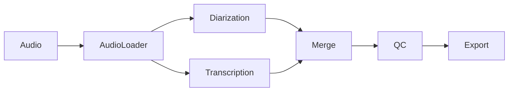

# 🏗️ Архитектура Speech Pipeline

## 📋 Обзор

Speech Pipeline v2.0 построен на модульной агентной архитектуре, где каждый компонент отвечает за конкретную задачу в pipeline обработки аудио. Система поддерживает три основных метода обработки с возможностью расширения.

## 🎯 Основные принципы

### SOLID принципы
- **S**ingle Responsibility: Каждый агент решает одну задачу
- **O**pen/Closed: Легко добавлять новые агенты
- **L**iskov Substitution: Взаимозаменяемые агенты
- **I**nterface Segregation: Четкие интерфейсы
- **D**ependency Inversion: Агенты не зависят от конкретных реализаций

### Модульность
- Независимые компоненты
- Четкие интерфейсы между модулями
- Возможность тестирования в изоляции
- Простота замены компонентов

## 🔧 Агенты системы

### AudioLoaderAgent
**Назначение**: Загрузка и конвертация аудиофайлов  
**Входные данные**: Локальные файлы или URL  
**Выходные данные**: WAV 16kHz + remote URL  
**Технологии**: FFmpeg, pyannote.ai Media API

### DiarizationAgent  
**Назначение**: Разделение спикеров  
**Входные данные**: Audio URL  
**Выходные данные**: JSON сегменты с спикерами  
**Технологии**: pyannote.ai Diarization API

### TranscriptionAgent
**Назначение**: Преобразование речи в текст  
**Входные данные**: WAV файл  
**Выходные данные**: JSON сегменты с текстом  
**Технологии**: OpenAI Whisper API

### MergeAgent
**Назначение**: Объединение результатов диаризации и транскрипции  
**Входные данные**: 2 JSON файла  
**Выходные данные**: Объединенный JSON  
**Алгоритм**: Overlap-based matching

### QCAgent
**Назначение**: Контроль качества данных  
**Проверки**: Временные метки, текст, спикеры  
**Метрики**: Quality score, статистика  

### ExportAgent
**Назначение**: Экспорт в различные форматы  
**Форматы**: SRT, ASS, JSON, TXT  
**Функции**: Форматирование, цветовая схема

### VoiceprintAgent
**Назначение**: Создание голосовых отпечатков  
**Технологии**: pyannote.ai Voiceprint API  
**Особенности**: ≤30 секунд аудио

### IdentificationAgent
**Назначение**: Идентификация спикеров через voiceprints  
**Алгоритм**: Similarity matching  
**Порог**: Настраиваемый threshold

### ReplicateAgent
**Назначение**: Быстрая обработка через Replicate  
**Модель**: thomasmol/whisper-diarization  
**Преимущества**: Скорость, качество

## 🔄 Архитектурные паттерны

### Pipeline Pattern
```
Input → Agent1 → Agent2 → ... → Output
```
Последовательная обработка с сохранением промежуточных результатов.

### Strategy Pattern
```
Context → [StandardStrategy | ReplicateStrategy | VoiceprintStrategy]
```
Выбор стратегии обработки в зависимости от параметров.

### Factory Pattern
```
AgentFactory → [AudioAgent | DiarizationAgent | TranscriptionAgent]
```
Создание агентов с правильной конфигурацией.

## 📁 Структура проекта

```
pipeline/
├── __init__.py
├── agents/                    # Базовые классы агентов
│   ├── base_agent.py         # Абстрактный агент
│   └── interfaces.py         # Интерфейсы
├── audio_agent.py            # Загрузка и конвертация
├── diarization_agent.py      # Диаризация
├── transcription_agent.py    # Транскрипция
├── merge_agent.py            # Объединение
├── qc_agent.py              # Контроль качества
├── export_agent.py          # Экспорт
├── voiceprint_agent.py      # Voiceprints
├── identification_agent.py  # Идентификация
├── replicate_agent.py       # Replicate интеграция
├── managers/                # Менеджеры
│   ├── config_manager.py    # Конфигурация
│   └── voiceprint_manager.py # Voiceprints база
└── utils/                   # Утилиты
    ├── security_validator.py # Безопасность
    └── logger.py           # Логирование
```

## 🔀 Потоки данных

### Стандартный поток


### Replicate поток  


### Voiceprint поток


## 🛡️ Безопасность

### Валидация входных данных
- Проверка MIME типов
- Ограничения размера файлов
- Валидация URL
- Санитизация путей

### API безопасность
- Только HTTPS соединения
- Валидация API ключей
- Rate limiting (планируется)
- Timeout для запросов

### Обработка секретов
- Переменные окружения
- Никаких секретов в коде
- Безопасное логирование

## ⚡ Производительность

### Оптимизации
- Кэширование результатов
- Потоковая обработка больших файлов
- Параллельная обработка (планируется)
- Сжатие промежуточных данных

### Метрики
- Время обработки на минуту аудио
- Использование памяти
- Пропускная способность
- Quality scores

## 🔍 Мониторинг

### Логирование
- Структурированные JSON логи
- Разделение по уровням
- Ротация файлов
- Метрики производительности

### Здоровье системы
- Health check endpoints
- Валидация компонентов
- Мониторинг зависимостей
- Алертинг при ошибках

## 🚀 Расширяемость

### Добавление новых агентов
1. Наследование от BaseAgent
2. Реализация интерфейса
3. Регистрация в фабрике
4. Добавление тестов

### Новые форматы экспорта
1. Расширение ExportAgent
2. Добавление форматтера
3. Обновление CLI
4. Документация

### Интеграции с внешними API
1. Создание адаптера
2. Реализация retry логики
3. Добавление конфигурации
4. Мониторинг метрик

## 🎯 Будущее развитие

### Q1 2025: Performance & Security
- Асинхронная обработка
- Redis кэширование
- Rate limiting
- Мониторинг метрик

### Q2 2025: Web Interface
- FastAPI backend
- React frontend
- WebSocket прогресс
- Batch обработка

### Q3 2025: Microservices
- Разделение на сервисы
- Service mesh
- Kubernetes deploy
- CI/CD автоматизация

### Q4 2025: Enterprise
- Multi-tenancy
- RBAC
- Compliance
- Analytics
