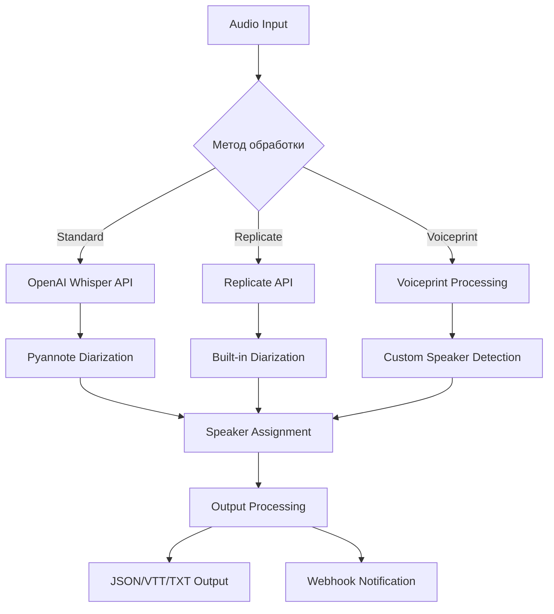

# 🔄 Потоки данных и взаимодействие компонентов

> Детальное описание потоков данных в ERNI Audio v2

## 📋 Содержание
- [Общий обзор потоков](#общий-обзор-потоков)
- [Стандартный метод обработки](#стандартный-метод-обработки)
- [Метод Replicate](#метод-replicate)
- [Метод Voiceprint](#метод-voiceprint)
- [Webhook потоки](#webhook-потоки)

## 🌊 Общий обзор потоков



## 🔄 Стандартный метод обработки

### Этапы обработки:
1. **Audio Input Validation**
2. **OpenAI Whisper Transcription**
3. **Pyannote Diarization**
4. **Speaker Assignment**
5. **Output Generation**

### Поток данных:
```
Audio File → OpenAI API → Transcript → Pyannote → Speaker Labels → Final Output
```

## 🚀 Метод Replicate

### Особенности:
- Встроенная диаризация
- Быстрая обработка
- Хорошее качество

### Поток данных:
```
Audio File → Replicate API → {Transcript + Speakers} → Output Processing → Final Output
```

## 👤 Метод Voiceprint

### Этапы:
1. **Voiceprint Matching**
2. **Custom Speaker Detection**
3. **Targeted Transcription**

### Поток данных:
```
Audio File + Voiceprints → Speaker Detection → Segment Assignment → Transcription → Final Output
```

---

*См. также: [Техническое руководство по потокам данных](DATA_FLOWS_TECHNICAL_GUIDE.md)*
