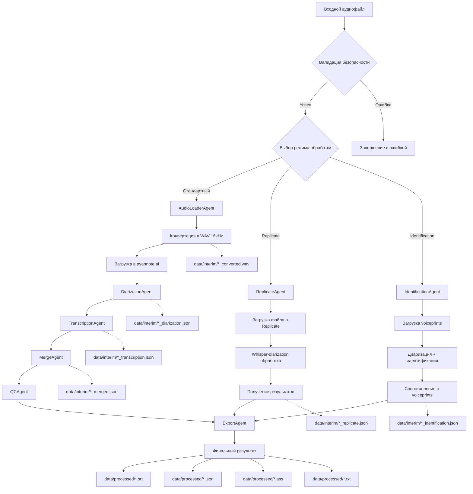
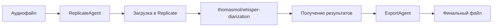
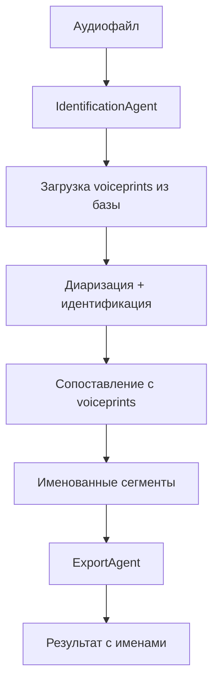

# Erni Audio v2: Технический гид по потокам данных

## Обзор

Erni Audio v2 представляет собой модульную систему обработки аудио с агентной архитектурой, поддерживающую множественные пути обработки данных в зависимости от требований пользователя. Система построена на принципах SOLID и использует четко определенные интерфейсы для взаимодействия между компонентами.

## Архитектурная диаграмма потоков данных



## Детальное описание этапов pipeline

### 1. Валидация входных данных

**Компонент:** `SecurityValidator`
**Местоположение:** `pipeline/security_validator.py`

#### Входные данные:
- **Локальные файлы:** Поддерживаемые форматы: `.wav`, `.mp3`, `.m4a`, `.mp4`, `.avi`, `.mov`
- **URL:** HTTPS ссылки на аудио/видео файлы
- **Ограничения:** Максимальный размер 500MB, безопасные пути

#### Процесс обработки:
```python
# Валидация файла
is_valid, message = SECURITY_VALIDATOR.validate_file(file_path)
# Валидация URL
is_valid, message = SECURITY_VALIDATOR.validate_url(url)
```

#### Выходные данные:
- **Успех:** Валидированный путь к файлу
- **Ошибка:** Исключение с описанием проблемы

### 2. AudioLoaderAgent - Конвертация и загрузка

**Компонент:** `AudioLoaderAgent`
**Местоположение:** `pipeline/audio_agent.py`

#### Входные данные:
- Валидированный аудио/видео файл любого формата
- Опциональный remote WAV URL для пропуска конвертации

#### Процесс обработки:
1. **Конвертация через FFmpeg:**
   ```bash
   ffmpeg -i input.m4a -ar 16000 -ac 1 -c:a pcm_s16le output.wav
   ```
2. **Загрузка в pyannote.ai Media API:**
   ```python
   response = requests.post(
       "https://api.pyannote.ai/v1/upload",
       files={"file": wav_file},
       headers={"Authorization": f"Bearer {api_key}"}
   )
   ```

#### Выходные данные:
- **Локальный файл:** `data/interim/{filename}_converted.wav`
- **Удаленный URL:** `https://api.pyannote.ai/v1/media/{media_id}`
- **Метаданные:** Длительность, размер, частота дискретизации

#### Пример для файла заседания:
```json
{
  "local_path": "data/interim/Sitzung Erweiterte GL 17.04.2025_converted.wav",
  "remote_url": "https://api.pyannote.ai/v1/media/abc123def456",
  "duration_seconds": 7860.5,
  "file_size_mb": 214.3,
  "sample_rate": 16000
}
```

### 3. DiarizationAgent - Разделение спикеров

**Компонент:** `DiarizationAgent`
**Местоположение:** `pipeline/diarization_agent.py`

#### Входные данные:
- **URL аудио:** Ссылка на файл в pyannote.ai
- **Режим:** Стандартная диаризация или идентификация с voiceprints

#### Процесс обработки:
1. **Запуск диаризации:**
   ```python
   response = requests.post(
       "https://api.pyannote.ai/v1/diarize",
       json={"url": audio_url},
       headers={"Authorization": f"Bearer {api_key}"}
   )
   ```
2. **Ожидание результатов:** Polling каждые 5 секунд
3. **Получение сегментов:** Парсинг JSON ответа

#### Выходные данные:
**Файл:** `data/interim/{filename}_diarization.json`

**Структура данных:**
```json
[
  {
    "start": 0.0,
    "end": 3.5,
    "speaker": "SPEAKER_00",
    "confidence": 0.95
  },
  {
    "start": 3.5,
    "end": 8.2,
    "speaker": "SPEAKER_01",
    "confidence": 0.87
  }
]
```

#### Реальный пример из заседания:
```json
[
  {
    "start": 4.03,
    "end": 5.29,
    "speaker": "SPEAKER_02",
    "confidence": 0.92
  },
  {
    "start": 6.51,
    "end": 8.27,
    "speaker": "SPEAKER_02",
    "confidence": 0.89
  },
  {
    "start": 9.95,
    "end": 12.91,
    "speaker": "SPEAKER_00",
    "confidence": 0.94
  }
]
```

### 4. TranscriptionAgent - Преобразование речи в текст

**Компонент:** `TranscriptionAgent`
**Местоположение:** `pipeline/transcription_agent.py`

#### Входные данные:
- **Аудио файл:** Локальный WAV файл 16kHz
- **Модель:** `whisper-1`, `gpt-4o-mini-transcribe`, `gpt-4o-transcribe`
- **Язык:** Опциональный код языка (de, en, ru, etc.)
- **Промпт:** Контекстная информация для улучшения качества

#### Поддерживаемые модели:
```python
SUPPORTED_MODELS = {
    "whisper-1": {
        "name": "OpenAI Whisper v1",
        "cost_per_minute": 0.006,
        "cost_tier": "Экономичная",
        "quality": "Хорошая"
    },
    "gpt-4o-mini-transcribe": {
        "name": "GPT-4o Mini Transcribe",
        "cost_per_minute": 0.05,
        "cost_tier": "Средняя",
        "quality": "Очень хорошая"
    },
    "gpt-4o-transcribe": {
        "name": "GPT-4o Transcribe",
        "cost_per_minute": 0.10,
        "cost_tier": "Премиум",
        "quality": "Превосходная"
    }
}
```

#### Процесс обработки:
1. **Подготовка запроса:**
   ```python
   with open(audio_file, 'rb') as f:
       response = openai.audio.transcriptions.create(
           model=model_name,
           file=f,
           response_format="verbose_json",
           language=language,
           prompt=prompt
       )
   ```
2. **Обработка ответа:** Извлечение сегментов с временными метками
3. **Валидация:** Проверка качества и полноты результатов

#### Выходные данные:
**Файл:** `data/interim/{filename}_transcription.json`

**Структура данных:**
```json
[
  {
    "start": 4.03,
    "end": 5.29,
    "text": "Jetzt bin ich es einlassen.",
    "confidence": 0.98,
    "language": "de"
  },
  {
    "start": 6.51,
    "end": 8.27,
    "text": "Ich habe erst jetzt gestartet. Sorry.",
    "confidence": 0.95,
    "language": "de"
  }
]
```

### 5. MergeAgent - Объединение результатов

**Компонент:** `MergeAgent`
**Местоположение:** `pipeline/merge_agent.py`

#### Входные данные:
- **Диаризация:** `data/interim/{filename}_diarization.json`
- **Транскрипция:** `data/interim/{filename}_transcription.json`

#### Процесс обработки:
1. **Алгоритм пересечения сегментов:**
   ```python
   def calculate_overlap(seg1, seg2):
       overlap_start = max(seg1['start'], seg2['start'])
       overlap_end = min(seg1['end'], seg2['end'])
       return max(0, overlap_end - overlap_start)
   ```
2. **Сопоставление по максимальному пересечению**
3. **Объединение метаданных**

#### Выходные данные:
**Файл:** `data/interim/{filename}_merged.json`

**Структура объединенных данных:**
```json
[
  {
    "start": 4.03,
    "end": 5.29,
    "speaker": "SPEAKER_02",
    "text": "Jetzt bin ich es einlassen.",
    "confidence": 0.92,
    "transcription_confidence": 0.98,
    "overlap_ratio": 0.95
  }
]
```

### 6. QCAgent - Контроль качества

**Компонент:** `QCAgent`
**Местоположение:** `pipeline/qc_agent.py`

#### Процесс валидации:
1. **Проверка временных меток:** Отсутствие пересечений, правильная последовательность
2. **Валидация текста:** Непустые строки, корректная кодировка
3. **Проверка спикеров:** Консистентность идентификаторов
4. **Метрики качества:** Расчет статистик

#### Выходные метрики:
```json
{
  "total_segments": 557,
  "total_duration": 2400.5,
  "speakers_count": 7,
  "average_segment_length": 4.31,
  "text_coverage": 0.98,
  "quality_score": 0.94
}
```

### 7. ExportAgent - Финальный экспорт

**Компонент:** `ExportAgent`
**Местоположение:** `pipeline/export_agent.py`

#### Поддерживаемые форматы:

##### SRT (SubRip)
```srt
1
00:00:04,030 --> 00:00:05,290
SPEAKER_02: Jetzt bin ich es einlassen.

2
00:00:06,510 --> 00:00:08,270
SPEAKER_02: Ich habe erst jetzt gestartet. Sorry.
```

##### ASS (Advanced SubStation Alpha)
```ass
[V4+ Styles]
Format: Name, Fontname, Fontsize, PrimaryColour, ...
Style: SPEAKER_02,Arial,20,&H00FF6B6B,&H000000FF,...

[Events]
Format: Layer, Start, End, Style, Name, MarginL, MarginR, MarginV, Effect, Text
Dialogue: 0,0:00:04.03,0:00:05.29,SPEAKER_02,,0,0,0,,Jetzt bin ich es einlassen.
```

##### JSON (Структурированные данные)
```json
{
  "metadata": {
    "duration": 2400.5,
    "speakers": 7,
    "segments": 557,
    "processing_time": 45.2
  },
  "segments": [...]
}
```

##### TXT (Простой текст)
```txt
[00:00:04] SPEAKER_02: Jetzt bin ich es einlassen.
[00:00:06] SPEAKER_02: Ich habe erst jetzt gestartet. Sorry.
```

## Альтернативные потоки данных

### Replicate Pipeline

**Диаграмма потока:**


#### Особенности:
- **Скорость:** В 3-5 раз быстрее стандартного pipeline
- **Стоимость:** Примерно $0.02 за минуту аудио
- **Качество:** Хорошее для большинства случаев
- **Ограничения:** Только локальные файлы, фиксированные параметры

#### Структура результата:
```json
[
  {
    "start": 4.03,
    "end": 5.29,
    "speaker": "SPEAKER_02",
    "text": "Jetzt bin ich es einlassen.",
    "avg_logprob": -0.15,
    "no_speech_prob": 0.02
  }
]
```

### Identification Pipeline (Voiceprints)

**Диаграмма потока:**


#### Процесс создания voiceprints:
1. **Извлечение сегментов:** 15-30 секунд чистой речи
2. **Создание отпечатка:** Через pyannote.ai Voiceprint API
3. **Сохранение в базе:** JSON файл с метаданными

#### Структура voiceprint:
```json
{
  "id": "abc123-def456-789",
  "name": "Peter Henkler",
  "created_at": "2025-06-01T12:00:00Z",
  "audio_file": "peter_henkler_sample.m4a",
  "duration": 25.3,
  "quality_score": 0.94
}
```

#### Результат идентификации:
```json
[
  {
    "start": 20.91,
    "end": 25.04,
    "speaker": "Peter Henkler",
    "match": "Peter Henkler",
    "confidence": 1.0,
    "diarization_speaker": "SPEAKER_00"
  }
]
```

## Структура данных и жизненный цикл файлов

### Директории проекта

```
erni_audio_v2/
├── data/
│   ├── raw/                    # Исходные файлы
│   ├── interim/                # Промежуточные результаты
│   └── processed/              # Финальные результаты
├── voiceprints/               # База голосовых отпечатков
│   ├── audio/                 # Аудиофайлы voiceprints
│   └── voiceprints.json       # Метаданные
├── logs/                      # Логи системы
├── cache/                     # Кэш результатов
└── config/                    # Конфигурационные файлы
```

### Жизненный цикл промежуточных файлов

#### Стандартный pipeline:
1. `{filename}_converted.wav` - Конвертированное аудио (сохраняется)
2. `{filename}_diarization.json` - Результат диаризации (сохраняется)
3. `{filename}_transcription.json` - Результат транскрипции (сохраняется)
4. `{filename}_merged.json` - Объединенные данные (сохраняется)

#### Replicate pipeline:
1. `{filename}_replicate.json` - Результат Replicate (сохраняется)

#### Identification pipeline:
1. `{filename}_identification.json` - Результат идентификации (сохраняется)

### Схемы JSON данных

#### Базовый сегмент:
```json
{
  "$schema": "http://json-schema.org/draft-07/schema#",
  "type": "object",
  "properties": {
    "start": {"type": "number", "minimum": 0},
    "end": {"type": "number", "minimum": 0},
    "speaker": {"type": "string"},
    "text": {"type": "string"},
    "confidence": {"type": "number", "minimum": 0, "maximum": 1}
  },
  "required": ["start", "end"]
}
```

#### Расширенный сегмент (identification):
```json
{
  "allOf": [{"$ref": "#/definitions/baseSegment"}],
  "properties": {
    "match": {"type": "string"},
    "diarization_speaker": {"type": "string"},
    "voiceprint_id": {"type": "string"},
    "matching_score": {"type": "number"}
  }
}
```

## Обработка ошибок и восстановление

### Точки сохранения состояния

1. **После конвертации аудио:** Сохранение WAV файла
2. **После диаризации:** Сохранение JSON результата
3. **После транскрипции:** Сохранение JSON результата
4. **После объединения:** Сохранение финального JSON

### Механизмы восстановления

#### Проверка существующих файлов:
```python
def check_existing_results(input_file, stage):
    interim_file = f"data/interim/{input_file.stem}_{stage}.json"
    if Path(interim_file).exists():
        logger.info(f"Найден существующий результат: {interim_file}")
        return load_json(interim_file)
    return None
```

#### Валидация между этапами:
```python
def validate_stage_output(data, stage):
    validators = {
        'diarization': validate_diarization_segments,
        'transcription': validate_transcription_segments,
        'merged': validate_merged_segments
    }
    return validators[stage](data)
```

### Обработка ошибок API

#### Retry механизм:
```python
@retry(
    stop=stop_after_attempt(3),
    wait=wait_exponential(multiplier=1, min=4, max=10),
    retry=retry_if_exception_type(requests.RequestException)
)
def api_call_with_retry(url, data):
    return requests.post(url, json=data)
```

#### Fallback стратегии:
- **Диаризация:** Переход на Replicate при недоступности pyannote.ai
- **Транскрипция:** Использование более простой модели при ошибках
- **Экспорт:** Сохранение в JSON при ошибках форматирования

## Производительность и оптимизация

### Метрики производительности

#### Время обработки по этапам (файл 2ч 11мин):
```json
{
  "audio_conversion": "15.3s",
  "upload_to_pyannote": "45.2s",
  "diarization": "180.5s",
  "transcription": "420.8s",
  "merge": "2.1s",
  "export": "1.2s",
  "total": "665.1s"
}
```

#### Размеры файлов:
```json
{
  "original_m4a": "214.3 MB",
  "converted_wav": "1.2 GB",
  "diarization_json": "45.2 KB",
  "transcription_json": "892.1 KB",
  "merged_json": "1.1 MB",
  "final_srt": "156.3 KB"
}
```

### Оптимизации

#### Параллельная обработка:
- Диаризация и транскрипция могут выполняться параллельно
- Кэширование результатов API вызовов
- Сжатие промежуточных JSON файлов

#### Управление памятью:
- Потоковая обработка больших файлов
- Очистка временных файлов после использования
- Ограничение размера кэша

### Мониторинг и логирование

#### Структурированные логи:
```json
{
  "timestamp": "2025-06-01T12:00:00Z",
  "level": "INFO",
  "component": "TranscriptionAgent",
  "operation": "transcribe",
  "duration_ms": 15420,
  "input_size_mb": 214.3,
  "output_segments": 557,
  "model": "whisper-1",
  "success": true
}
```

#### Метрики для мониторинга:
- Время обработки на минуту аудио
- Частота ошибок API
- Использование дискового пространства
- Качество результатов (confidence scores)

## Примеры использования

### Простая транскрипция:
```bash
python3 speech_pipeline.py audio.m4a -o transcript.srt
```

### Диаризация с Replicate:
```bash
python3 speech_pipeline.py audio.m4a --use-replicate --replicate-speakers 5 -o result.json --format json
```

### Идентификация с voiceprints:
```bash
python3 speech_pipeline.py audio.m4a --use-identification --voiceprints "John Doe,Jane Smith" -o meeting.ass --format ass
```

### Создание voiceprint:
```bash
python3 -m pipeline.voiceprint_cli create sample.m4a "John Doe"
```

## Заключение

Система Erni Audio v2 предоставляет гибкую архитектуру для обработки аудио с множественными путями данных, обеспечивая высокое качество результатов при оптимальной производительности. Модульная структура позволяет легко расширять функциональность и адаптировать систему под различные требования.
