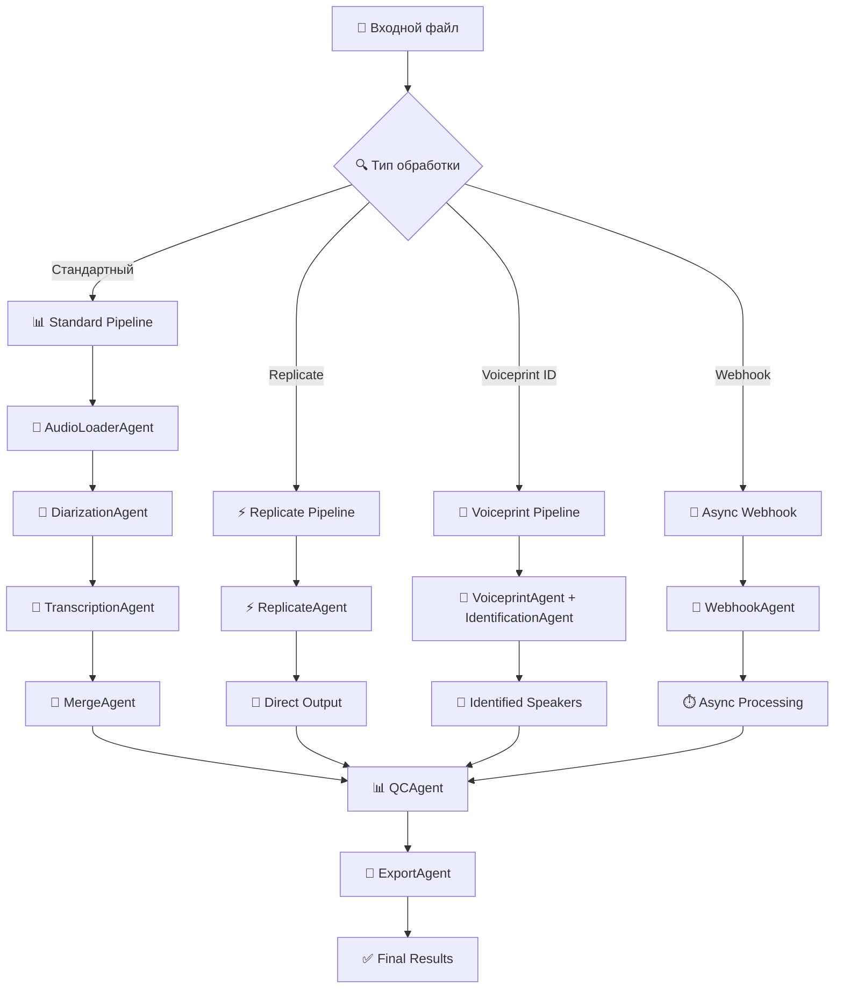

# 🎙️ Полная схема обработки аудио в ERNI Audio v2

## 🏗️ Архитектура обработки



## 🛤️ Четыре основных пути обработки

### 1. 📊 **СТАНДАРТНЫЙ ПАЙПЛАЙН** (рекомендуется для большинства случаев)

**Архитектура**: AudioLoader → Diarization → Transcription → Merge → Export

**Особенности**:
- Полный контроль над всеми параметрами
- Поддержка 3 моделей транскрипции
- 3 алгоритма слияния результатов
- Максимальная гибкость настроек

**Когда использовать**:
- Когда нужен полный контроль над процессом
- Для специфических настроек диаризации
- При работе со сложными аудио файлами

### 2. ⚡ **REPLICATE ПАЙПЛАЙН** (быстро и экономично)

**Архитектура**: AudioLoader → ReplicateAgent → Export

**Особенности**:
- В 2 раза быстрее стандартного
- В 167 раз дешевле (~$0.008 vs ~$1.34)
- Whisper Large V3 Turbo + Pyannote 3.3.1
- Автоматическая диаризация + транскрипция

**Когда использовать**:
- Для массовой обработки
- Когда важна скорость и экономия
- Для стандартных задач без специфических требований

### 3. 👤 **VOICEPRINT ИДЕНТИФИКАЦИЯ** (точная идентификация)

**Архитектура**: AudioLoader → VoiceprintAgent/IdentificationAgent → Export

**Особенности**:
- Точная идентификация известных спикеров
- Предварительное создание voiceprint базы
- Настраиваемые пороги сходства
- Эксклюзивное/неэксклюзивное сопоставление

**Когда использовать**:
- Для регулярной работы с одними и теми же людьми
- В корпоративной среде (встречи, интервью)
- Когда критически важна точная идентификация

### 4. 🔗 **АСИНХРОННАЯ ОБРАБОТКА** (webhook-based)

**Архитектура**: WebhookServer → Async Processing → Notification

**Особенности**:
- Неблокирующая обработка больших файлов
- HMAC-SHA256 верификация
- Автоматические уведомления
- Масштабируемость

**Когда использовать**:
- Для интеграции с веб-приложениями
- При обработке больших объемов данных
- В production системах с высокой нагрузкой

## 🎯 Модели транскрипции

| Модель | Скорость | Качество | Стоимость | Применение |
|--------|----------|----------|-----------|-------------|
| **whisper-1** | ⚡⚡⚡ | ⭐⭐⭐ | 💰 | Быстрые задачи, черновики |
| **gpt-4o-mini-transcribe** | ⚡⚡ | ⭐⭐⭐⭐ | 💰💰 | Баланс цены и качества |
| **gpt-4o-transcribe** | ⚡ | ⭐⭐⭐⭐⭐ | 💰💰💰 | Максимальное качество |
| **replicate-whisper** | ⚡⚡⚡⚡ | ⭐⭐⭐⭐ | 💰 | Оптимальный выбор |

## 📁 Форматы вывода

**Поддерживаемые форматы** (8 типов):
- **SRT** - Стандартные субтитры
- **ASS** - Продвинутые субтитры для видео
- **VTT** - WebVTT для веб-плееров
- **TTML** - Timed Text Markup Language
- **JSON** - Структурированные данные
- **TXT** - Чистый текст
- **CSV** - Табличные данные
- **DOCX** - Документ Word

## 🎵 Поддерживаемые входные форматы

**Аудио форматы**:
- WAV, MP3, M4A, FLAC, OGG, AAC

**Видео форматы**:
- MP4, AVI, MOV (извлекается аудиодорожка)

**Ограничения**:
- Максимальный размер: 300MB
- Максимальная длительность: 24 часа
- Минимальный размер: 1KB

## 🔧 Вспомогательные утилиты

### 👤 Управление Voiceprints
- **Создание voiceprints** из аудио образцов
- **Анализ качества** voiceprint базы
- **Синхронизация** с удаленными хранилищами
- **Валидация и очистка** базы данных

### 📊 Тестирование качества
- **WER/CER оценка** качества транскрипции
- **Сравнение моделей** по метрикам
- **Benchmark тесты** производительности
- **Автоматизированное тестирование**

### 🔗 Webhook сервер
- **HTTP сервер** для приема событий
- **HMAC верификация** подписей
- **Health checks** и метрики
- **Graceful shutdown**

---

## 🚀 КОМАНДЫ ДЛЯ ВСЕХ ВАРИАНТОВ ОБРАБОТКИ

### 🏥 Диагностика системы

```bash
# Проверка готовности системы
python3 health_check.py

# Детальная диагностика
python3 health_check.py --detailed

# JSON отчет для автоматизации
python3 health_check.py --json

# Сохранение отчета
python3 health_check.py --save-report
```

### 📊 1. СТАНДАРТНЫЙ ПАЙПЛАЙН

#### Базовые команды

```bash
# Простая обработка (Whisper-1, SRT)
python3 speech_pipeline.py audio.wav

# Указание выходного файла
python3 speech_pipeline.py audio.wav -o result.srt

# Выбор формата
python3 speech_pipeline.py audio.wav --format json -o result.json

# Все форматы одновременно
python3 speech_pipeline.py audio.wav --all-formats

# С временными метками в имени
python3 speech_pipeline.py audio.wav --add-timestamp
```

#### Модели транскрипции

```bash
# Whisper-1 (быстро, дешево)
python3 speech_pipeline.py audio.wav \
  --transcription-model whisper-1 \
  --format srt -o result.srt

# GPT-4o Mini (баланс цены/качества)
python3 speech_pipeline.py audio.wav \
  --transcription-model gpt-4o-mini-transcribe \
  --language en \
  --format json -o result.json

# GPT-4o (максимальное качество)
python3 speech_pipeline.py audio.wav \
  --transcription-model gpt-4o-transcribe \
  --language ru \
  --format srt -o result.srt

# Оценка стоимости всех моделей
python3 speech_pipeline.py audio.wav --show-cost-estimate
```

#### Работа с языками

```bash
# Указание языка (улучшает точность)
python3 speech_pipeline.py audio.wav --language ru
python3 speech_pipeline.py audio.wav --language en  
python3 speech_pipeline.py audio.wav --language de
python3 speech_pipeline.py audio.wav --language fr
python3 speech_pipeline.py audio.wav --language es

# Контекстная подсказка
python3 speech_pipeline.py audio.wav \
  --prompt "Technical discussion about AI and machine learning" \
  --language en
```

#### Удаленные файлы

```bash
# Обработка файла по URL
python3 speech_pipeline.py dummy.wav \
  --remote-wav-url https://example.com/audio.wav \
  --format srt -o result.srt
```

### ⚡ 2. REPLICATE ПАЙПЛАЙН

```bash
# Базовая команда Replicate (рекомендуется)
python3 speech_pipeline.py audio.wav --use-replicate

# С указанием количества спикеров
python3 speech_pipeline.py audio.wav \
  --use-replicate \
  --replicate-speakers 2 \
  --format srt -o result.srt

# Replicate с языком
python3 speech_pipeline.py audio.wav \
  --use-replicate \
  --language de \
  --format json -o result.json

# Replicate для больших файлов
python3 speech_pipeline.py large_meeting.wav \
  --use-replicate \
  --replicate-speakers 5 \
  --all-formats
```

### 👤 3. VOICEPRINT ИДЕНТИФИКАЦИЯ

#### Создание voiceprints

```bash
# Создание voiceprint
python3 pipeline/voiceprint_cli.py create sample_john.wav "John Doe"

# Создание с оценкой стоимости
python3 pipeline/voiceprint_cli.py create sample_jane.wav "Jane Smith" --show-cost

# Создание без проверки длительности
python3 pipeline/voiceprint_cli.py create sample_alex.wav "Alex Johnson" --skip-duration-check

# Множественное создание
python3 pipeline/voiceprint_cli.py create sample1.wav "Person 1"
python3 pipeline/voiceprint_cli.py create sample2.wav "Person 2"
python3 pipeline/voiceprint_cli.py create sample3.wav "Person 3"
```

#### Управление базой voiceprints

```bash
# Список всех voiceprints
python3 pipeline/voiceprint_cli.py list

# Детальная информация
python3 pipeline/voiceprint_cli.py list --detailed

# Поиск по имени
python3 pipeline/voiceprint_cli.py search "John"

# Удаление voiceprint
python3 pipeline/voiceprint_cli.py delete "John Doe"

# Экспорт базы данных
python3 pipeline/voiceprint_cli.py export voiceprints_backup.json

# Импорт базы данных
python3 pipeline/voiceprint_cli.py import voiceprints_backup.json
```

#### Использование для идентификации

```bash
# Базовая идентификация
python3 speech_pipeline.py meeting.wav \
  --use-identification \
  --voiceprints "John Doe,Jane Smith"

# С настройкой порога сходства
python3 speech_pipeline.py meeting.wav \
  --use-identification \
  --voiceprints "John Doe,Jane Smith,Alex Johnson" \
  --matching-threshold 0.5

# Эксклюзивное сопоставление
python3 speech_pipeline.py meeting.wav \
  --use-identification \
  --voiceprints "John Doe,Jane Smith" \
  --matching-threshold 0.3 \
  --exclusive-matching

# Комбинация с конкретной моделью
python3 speech_pipeline.py meeting.wav \
  --use-identification \
  --voiceprints "John Doe,Jane Smith" \
  --transcription-model gpt-4o-transcribe \
  --language en \
  --format json -o identified_result.json
```

#### Продвинутое управление voiceprints

```bash
# Комплексный анализ базы
python3 pipeline/voiceprint_management_suite.py analyze

# Валидация всех voiceprints
python3 pipeline/voiceprint_management_suite.py validate

# Очистка недействительных voiceprints
python3 pipeline/voiceprint_management_suite.py cleanup

# Синхронизация с удаленным хранилищем
python3 pipeline/voiceprint_management_suite.py sync

# Проверка качества voiceprints
python3 pipeline/voiceprint_management_suite.py quality-check

# Создание отчета
python3 pipeline/voiceprint_management_suite.py report --format json
```

### 🔗 4. АСИНХРОННАЯ ОБРАБОТКА (Webhooks)

#### Запуск webhook сервера

```bash
# Базовый запуск
python3 pipeline/webhook_server_cli.py

# На конкретном порту
python3 pipeline/webhook_server_cli.py --port 9000

# Режим отладки
python3 pipeline/webhook_server_cli.py --debug

# С кастомным webhook секретом
python3 pipeline/webhook_server_cli.py \
  --webhook-secret "whs_your_custom_secret_here"

# В фоновом режиме
python3 pipeline/webhook_server_cli.py --daemon
```

#### Асинхронная обработка

```bash
# В отдельном терминале: запуск webhook сервера
python3 pipeline/webhook_server_cli.py &

# Асинхронная обработка
python3 speech_pipeline.py audio.wav \
  --async-webhook http://localhost:8000/webhook \
  --format srt -o result.srt

# С дополнительными параметрами
python3 speech_pipeline.py large_file.wav \
  --async-webhook http://localhost:8000/webhook \
  --transcription-model gpt-4o-transcribe \
  --language en \
  --all-formats
```

#### Проверка webhook сервера

```bash
# Health check
curl http://localhost:8000/health

# Метрики производительности
curl http://localhost:8000/metrics

# Статус активных задач
curl http://localhost:8000/status
```

### 📊 5. ТЕСТИРОВАНИЕ И ОЦЕНКА КАЧЕСТВА

#### WER/CER тестирование

```bash
# Автоматическое тестирование всех моделей
python3 pipeline/quality_testing_suite.py auto-test

# Тестирование конкретных файлов
python3 pipeline/quality_testing_suite.py test \
  --audio-files audio1.wav audio2.mp3 \
  --reference-texts "Эталонный текст 1" "Эталонный текст 2"

# Тестирование конкретных моделей
python3 pipeline/quality_testing_suite.py test \
  --models whisper-1 gpt-4o-transcribe \
  --language ru

# Сравнительный анализ
python3 pipeline/quality_testing_suite.py compare \
  --audio-file test_audio.wav \
  --reference-text "Эталонный текст для сравнения"

# Benchmark производительности
python3 pipeline/quality_testing_suite.py benchmark \
  --duration 60 \
  --iterations 10
```

#### Демонстрационное тестирование

```bash
# Демо с тестовыми данными
python3 pipeline/quality_testing_suite.py demo

# Детальное демо с метриками
python3 pipeline/quality_testing_suite.py demo --verbose

# Создание отчета
python3 pipeline/quality_testing_suite.py demo --report
```

### 🔧 6. СПЕЦИАЛЬНЫЕ КОМАНДЫ

#### Извлечение voiceprint сэмплов

```bash
# Извлечение сэмплов для каждого спикера
python3 speech_pipeline.py meeting.wav \
  --voiceprints-dir extracted_samples/

# С ограничением длительности
python3 speech_pipeline.py meeting.wav \
  --voiceprints-dir extracted_samples/ \
  --max-sample-duration 20
```

#### Работа с Docker

```bash
# Сборка образа
docker build -t erni-audio-v2 .

# Запуск контейнера
docker run -it --rm \
  -v $(pwd)/data:/app/data \
  -v $(pwd)/logs:/app/logs \
  -e PYANNOTEAI_API_TOKEN="your_token" \
  -e OPENAI_API_KEY="your_key" \
  erni-audio-v2 audio.wav --format srt

# Docker Compose
docker-compose up -d

# Обработка через Docker Compose
docker-compose exec erni-audio python3 speech_pipeline.py audio.wav
```

---

## 🎯 РЕКОМЕНДАЦИИ ПО ВЫБОРУ ВАРИАНТА

### 💼 **Для бизнеса / Production**
```bash
# Оптимальный выбор: Replicate + GPT-4o Mini
python3 speech_pipeline.py meeting.wav \
  --use-replicate \
  --language en \
  --format json -o result.json
```

### 🎓 **Для образования / исследований**
```bash
# Максимальное качество
python3 speech_pipeline.py lecture.wav \
  --transcription-model gpt-4o-transcribe \
  --language en \
  --all-formats
```

### 🏢 **Для корпоративных встреч**
```bash
# С идентификацией сотрудников
python3 speech_pipeline.py team_meeting.wav \
  --use-identification \
  --voiceprints "John Smith,Sarah Johnson,Mike Davis" \
  --transcription-model gpt-4o-mini-transcribe \
  --format docx -o meeting_transcript.docx
```

### 🚀 **Для массовой обработки**
```bash
# Быстро и экономично
python3 speech_pipeline.py large_dataset.wav \
  --use-replicate \
  --replicate-speakers 3 \
  --format csv -o batch_results.csv
```

### 🔬 **Для тестирования и разработки**
```bash
# Полный цикл с анализом качества
python3 speech_pipeline.py test_sample.wav \
  --transcription-model whisper-1 \
  --all-formats

python3 pipeline/quality_testing_suite.py test \
  --audio-file test_sample.wav \
  --reference-text "Эталонный текст"
```

---

## ⚡ ПРОИЗВОДИТЕЛЬНОСТЬ И СТОИМОСТЬ

| Метод | Время (3.7 мин) | Стоимость | Качество | Рекомендация |
|-------|------------------|-----------|----------|--------------|
| **Replicate** | ~1.8с | $0.008 | ⭐⭐⭐⭐ | ✅ Оптимальный |
| **Whisper-1** | ~5.6с | $0.006 | ⭐⭐⭐ | 💰 Экономичный |
| **GPT-4o Mini** | ~3.8с | $0.012 | ⭐⭐⭐⭐ | ⚖️ Сбалансированный |
| **GPT-4o Full** | ~5.2с | $0.024 | ⭐⭐⭐⭐⭐ | 👑 Премиум |

**Заключение**: Для большинства задач рекомендуется **Replicate** как оптимальное сочетание скорости, качества и стоимости.