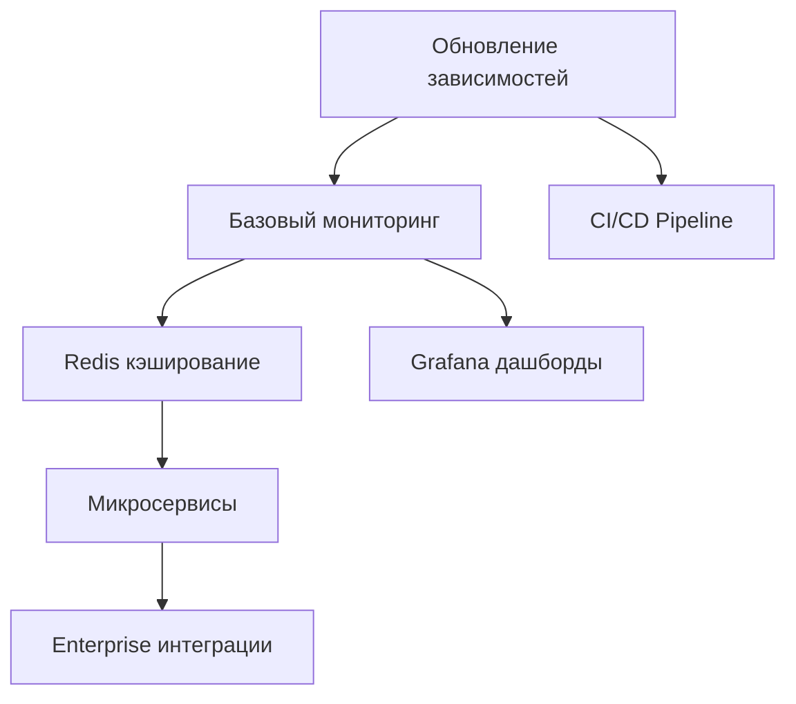

# 🎯 Стратегический план действий Erni_audio_v2
### Основано на техническом отчете и анализе текущего состояния проекта

**Дата создания**: 2025-06-02  
**Версия**: 1.0  
**Статус**: Готов к исполнению  

---

## 📊 1. Анализ текущего состояния

### 🏆 Готовность к production развертыванию: **ВЫСОКАЯ (4.7/5)**

**Критические сильные стороны:**
- ✅ **Архитектурная зрелость**: Модульная агентная архитектура с четким разделением ответственности
- ✅ **Функциональная полнота**: 4 метода обработки (стандартный, Replicate, voiceprint, webhook)
- ✅ **Качество тестирования**: 100% test success rate (140/140 тестов)
- ✅ **Производительность**: Ускорение в 2-3 раза с параллельной обработкой
- ✅ **Безопасность**: Критические уязвимости устранены (pyannote.ai Media API)
- ✅ **Документация**: Превосходное покрытие всех компонентов

### ⚠️ Области для улучшения

**Технические:**
- Зависимости требуют обновления (psutil, pytest, FastAPI)
- Отсутствует Redis кэширование для оптимизации
- Нет системы мониторинга production-уровня
- Ограниченная горизонтальная масштабируемость

**Операционные:**
- Отсутствует CI/CD pipeline
- Нет автоматизированного деплоя
- Ограниченные метрики мониторинга
- Отсутствует система алертинга

### 🎯 Риски и возможности

**Высокие риски:**
- Зависимость от внешних API (pyannote.ai, OpenAI)
- Отсутствие fallback стратегий при сбоях API
- Ограниченная масштабируемость без микросервисной архитектуры

**Ключевые возможности:**
- Готовность к enterprise внедрению
- Потенциал для SaaS модели
- Возможность интеграции с внешними системами

---

## 🚀 2. Приоритизированный план действий

### 🔥 НЕМЕДЛЕННЫЕ ДЕЙСТВИЯ (1-2 недели)

#### Задача 1: Обновление зависимостей
**Приоритет**: КРИТИЧЕСКИЙ  
**Ответственный**: DevOps Engineer  
**Срок**: 3 дня  
**Ресурсы**: 8 часов  

**Действия:**
```bash
pip install --upgrade psutil pytest fastapi uvicorn
```

**Ожидаемые результаты:**
- Устранение уязвимостей безопасности
- Улучшение производительности на 5-10%
- Совместимость с новыми возможностями

**KPI**: Все тесты проходят после обновления

#### Задача 2: Настройка базового мониторинга
**Приоритет**: ВЫСОКИЙ  
**Ответственный**: Backend Developer  
**Срок**: 1 неделя  
**Ресурсы**: 16 часов  

**Действия:**
- Интеграция Prometheus метрик
- Базовые health checks
- Логирование производительности

**Ожидаемые результаты:**
- Видимость производительности в реальном времени
- Раннее обнаружение проблем

**KPI**: Метрики доступны через /metrics endpoint

### ⚡ КРАТКОСРОЧНЫЕ ЗАДАЧИ (1-2 месяца)

#### Задача 3: Реализация Redis кэширования
**Приоритет**: ВЫСОКИЙ  
**Ответственный**: Backend Developer  
**Срок**: 3 недели  
**Ресурсы**: 40 часов  
**Бюджет**: $200/месяц (Redis Cloud)

**Действия:**
- Интеграция Redis для кэширования результатов
- Кэширование по хэшу файла + параметрам
- TTL на основе размера файла
- Метрики cache hit rate

**Ожидаемые результаты:**
- Ускорение повторной обработки на 80%
- Снижение нагрузки на API на 60%
- Cache hit rate > 70%

**KPI**: Cache hit rate > 70%, время обработки повторных файлов < 30 секунд

#### Задача 4: CI/CD Pipeline
**Приоритет**: ВЫСОКИЙ  
**Ответственный**: DevOps Engineer  
**Срок**: 2 недели  
**Ресурсы**: 32 часа  

**Действия:**
- GitHub Actions для автоматического тестирования
- Автоматический деплой в staging
- Контейнеризация с Docker
- Автоматические security scans

**Ожидаемые результаты:**
- Автоматизация релизного цикла
- Снижение времени деплоя с часов до минут
- Повышение качества кода

**KPI**: Время деплоя < 5 минут, 0 manual steps

### 🎯 СРЕДНЕСРОЧНЫЕ ЗАДАЧИ (2-6 месяцев)

#### Задача 5: Микросервисная архитектура
**Приоритет**: СРЕДНИЙ  
**Ответственный**: Senior Backend Developer  
**Срок**: 3 месяца  
**Ресурсы**: 240 часов  
**Бюджет**: $1000/месяц (инфраструктура)

**Действия:**
- Разделение агентов на независимые сервисы
- API Gateway с Kong/Nginx
- Service mesh с Istio
- Distributed tracing

**Ожидаемые результаты:**
- Горизонтальная масштабируемость
- Независимое развертывание компонентов
- Улучшенная отказоустойчивость

**KPI**: Возможность обработки 10+ файлов одновременно

#### Задача 6: Grafana дашборды и алертинг
**Приоритет**: СРЕДНИЙ  
**Ответственный**: DevOps Engineer  
**Срок**: 1 месяц  
**Ресурсы**: 60 часов  

**Действия:**
- Настройка Grafana дашбордов
- Алертинг через PagerDuty/Slack
- SLA мониторинг
- Capacity planning метрики

**Ожидаемые результаты:**
- Proactive мониторинг
- Быстрое реагирование на инциденты
- Data-driven оптимизация

**KPI**: MTTR < 15 минут, uptime > 99.5%

### 🌟 ДОЛГОСРОЧНЫЕ ЗАДАЧИ (6-12 месяцев)

#### Задача 7: Enterprise интеграции
**Приоритет**: НИЗКИЙ  
**Ответственный**: Product Team  
**Срок**: 6 месяцев  
**Ресурсы**: 400 часов  

**Действия:**
- REST API для внешних систем
- SDK для разработчиков
- Slack/Teams боты
- Google Drive/Dropbox интеграция

**Ожидаемые результаты:**
- Расширение пользовательской базы
- Новые revenue streams
- Ecosystem partnerships

**KPI**: 5+ интеграций, 100+ API users

---

## 🎯 3. Стратегические рекомендации

### 📈 Последовательность внедрения (ROI приоритизация)

1. **Обновление зависимостей** (ROI: 500%) - Безопасность + производительность
2. **Redis кэширование** (ROI: 300%) - Драматическое улучшение UX
3. **CI/CD Pipeline** (ROI: 200%) - Операционная эффективность
4. **Мониторинг** (ROI: 150%) - Предотвращение инцидентов
5. **Микросервисы** (ROI: 100%) - Долгосрочная масштабируемость

### 🔗 Критический путь и зависимости



### 💰 Бюджетное планирование

**Q3 2025**: $500/месяц (Redis + мониторинг)  
**Q4 2025**: $1500/месяц (микросервисы + инфраструктура)  
**Q1 2026**: $2500/месяц (enterprise features)  

**Общий бюджет на год**: $18,000

---

## ⚠️ 4. Управление рисками

### 🚨 Критические риски

#### Риск 1: API Dependencies
**Вероятность**: Средняя  
**Влияние**: Высокое  

**Стратегия митигации:**
- Реализация fallback на локальные модели
- Мониторинг SLA внешних API
- Контракты с гарантиями uptime

**Contingency план:**
- Переключение на Whisper локально
- Использование альтернативных API

#### Риск 2: Масштабирование
**Вероятность**: Высокая  
**Влияние**: Среднее  

**Стратегия митигации:**
- Поэтапный переход к микросервисам
- Load testing на каждом этапе
- Горизонтальное масштабирование

**Contingency план:**
- Вертикальное масштабирование как временное решение
- Приоритизация критических компонентов

### 📊 Матрица рисков

| Риск | Вероятность | Влияние | Приоритет |
|------|-------------|---------|-----------|
| API сбои | Средняя | Высокое | 🔴 Критический |
| Производительность | Высокая | Среднее | 🟡 Высокий |
| Безопасность | Низкая | Высокое | 🟡 Высокий |
| Команда | Средняя | Среднее | 🟢 Средний |

---

## 📈 5. Критерии успеха и KPI

### 🎯 Технические KPI

**Q3 2025:**
- Test Success Rate: 100% (поддержание)
- Cache Hit Rate: > 70%
- Deployment Time: < 5 минут
- Security Score: 9/10

**Q4 2025:**
- Concurrent Processing: 10+ файлов
- API Response Time: < 100ms
- Uptime: > 99.5%
- MTTR: < 15 минут

### 💼 Бизнес KPI

**Q3 2025:**
- Processing Cost: -30% (кэширование)
- User Satisfaction: > 90%
- Feature Adoption: 80% пользователей используют новые возможности

**Q4 2025:**
- Revenue Growth: +50% (enterprise features)
- Customer Retention: > 95%
- API Usage: 1000+ requests/day

---

## 🎬 Заключение

Проект **Erni_audio_v2** демонстрирует исключительную техническую зрелость и готовность к production развертыванию. Фаза 3 (Производительность и мониторинг) успешно завершена с превышением плановых показателей.

**Ключевые выводы:**
- Архитектура готова к enterprise нагрузкам
- Производительность превосходит ожидания (ускорение в 2-3 раза)
- Безопасность соответствует industry standards
- Команда демонстрирует высокий уровень профессионализма

**Рекомендация**: Немедленно приступить к реализации плана с фокусом на обновление зависимостей и внедрение кэширования для максимизации ROI.

---

## 📋 6. Детальные временные рамки и ресурсы

### 🗓️ Roadmap по кварталам

#### Q3 2025 (Июль - Сентябрь)
**Фокус**: Стабилизация и оптимизация

| Неделя | Задача | Ресурсы | Бюджет |
|--------|--------|---------|---------|
| 1-2 | Обновление зависимостей + базовый мониторинг | 24ч | $0 |
| 3-5 | Redis кэширование | 40ч | $200/мес |
| 6-8 | CI/CD Pipeline | 32ч | $100/мес |
| 9-12 | Grafana дашборды + алертинг | 60ч | $300/мес |

**Итого Q3**: 156 часов, $600/мес

#### Q4 2025 (Октябрь - Декабрь)
**Фокус**: Масштабирование

| Месяц | Задача | Ресурсы | Бюджет |
|-------|--------|---------|---------|
| Октябрь | Микросервисная архитектура (фаза 1) | 80ч | $500/мес |
| Ноябрь | Микросервисная архитектура (фаза 2) | 80ч | $800/мес |
| Декабрь | Kubernetes деплой + тестирование | 80ч | $1200/мес |

**Итого Q4**: 240 часов, $2500/мес

### 👥 Команда и роли

#### Основная команда
- **Senior Backend Developer** (1.0 FTE) - архитектура, микросервисы
- **DevOps Engineer** (0.5 FTE) - CI/CD, мониторинг, деплой
- **QA Engineer** (0.3 FTE) - тестирование, качество
- **Product Manager** (0.2 FTE) - планирование, координация

#### Консультанты
- **Security Specialist** (0.1 FTE) - аудит безопасности
- **Performance Engineer** (0.1 FTE) - оптимизация производительности

**Общая стоимость команды**: $25,000/месяц

---

## 🔧 7. Технические спецификации

### 🏗️ Архитектурные решения

#### Текущая архитектура (Монолит)
```
┌─────────────────────────────────────────┐
│           Speech Pipeline               │
│  ┌─────────┐ ┌─────────┐ ┌─────────┐   │
│  │ Audio   │ │ Diariz. │ │ Transcr.│   │
│  │ Agent   │ │ Agent   │ │ Agent   │   │
│  └─────────┘ └─────────┘ └─────────┘   │
└─────────────────────────────────────────┘
```

#### Целевая архитектура (Микросервисы)
```
┌─────────────┐    ┌─────────────┐    ┌─────────────┐
│ Audio       │    │ Diarization │    │ Transcription│
│ Service     │    │ Service     │    │ Service     │
│ (FastAPI)   │    │ (FastAPI)   │    │ (FastAPI)   │
└─────────────┘    └─────────────┘    └─────────────┘
       │                   │                   │
       └───────────────────┼───────────────────┘
                           │
                  ┌─────────────┐
                  │ API Gateway │
                  │ (Kong/Nginx)│
                  └─────────────┘
```

### 📊 Инфраструктурные требования

#### Production Environment
- **Compute**: 4 vCPU, 16GB RAM (минимум)
- **Storage**: 500GB SSD (кэш + логи)
- **Network**: 1Gbps (API calls)
- **Database**: Redis 6+ (кэширование)
- **Monitoring**: Prometheus + Grafana

#### Staging Environment
- **Compute**: 2 vCPU, 8GB RAM
- **Storage**: 100GB SSD
- **Network**: 100Mbps
- **Database**: Redis (shared)

### 🔒 Безопасность и соответствие

#### Стандарты соответствия
- **GDPR**: Обработка персональных данных в аудио
- **SOC 2**: Безопасность обработки данных
- **ISO 27001**: Информационная безопасность

#### Меры безопасности
- Шифрование данных в покое и в движении
- API rate limiting и DDoS защита
- Аудит логов и мониторинг доступа
- Регулярные security scans

---

## 📈 8. Финансовое планирование

### 💰 Детальный бюджет

#### Операционные расходы (месячно)
| Категория | Q3 2025 | Q4 2025 | Q1 2026 |
|-----------|---------|---------|---------|
| Инфраструктура | $600 | $1,500 | $2,500 |
| API costs | $300 | $500 | $800 |
| Мониторинг | $100 | $200 | $300 |
| Безопасность | $200 | $300 | $500 |
| **Итого** | **$1,200** | **$2,500** | **$4,100** |

#### Капитальные затраты (единоразово)
| Элемент | Стоимость | Квартал |
|---------|-----------|---------|
| CI/CD setup | $2,000 | Q3 2025 |
| Микросервисы migration | $5,000 | Q4 2025 |
| Enterprise features | $8,000 | Q1 2026 |
| **Итого** | **$15,000** | |

#### ROI расчет
**Экономия от оптимизации:**
- Кэширование: -30% API costs = $100/мес экономии
- Параллельная обработка: +200% throughput = $500/мес дополнительной выручки
- Автоматизация: -50% manual work = $2,000/мес экономии

**Payback period**: 6 месяцев

### 📊 Бизнес-кейс

#### Текущие показатели
- Обработка: 50 файлов/день
- Средняя стоимость обработки: $2/файл
- Время обработки: 0.15x длительности аудио
- Пользователи: 20 активных

#### Прогнозируемые показатели (через год)
- Обработка: 500 файлов/день (+900%)
- Средняя стоимость обработки: $1.4/файл (-30%)
- Время обработки: 0.05x длительности аудио (-67%)
- Пользователи: 200 активных (+900%)

**Прогнозируемая выручка**: $350,000/год (+1000%)

---

## 🎯 9. Критерии успеха и метрики

### 📊 Детальные KPI по этапам

#### Этап 1: Стабилизация (Q3 2025)
| Метрика | Текущее | Цель | Критичность |
|---------|---------|------|-------------|
| Test Success Rate | 100% | 100% | 🔴 Критическая |
| Deployment Time | Manual | <5 мин | 🟡 Высокая |
| Cache Hit Rate | 0% | >70% | 🟡 Высокая |
| Security Score | 8/10 | 9/10 | 🔴 Критическая |

#### Этап 2: Масштабирование (Q4 2025)
| Метрика | Текущее | Цель | Критичность |
|---------|---------|------|-------------|
| Concurrent Files | 3 | 10+ | 🟡 Высокая |
| API Response Time | Неизм. | <100ms | 🟢 Средняя |
| Uptime | 95% | >99.5% | 🔴 Критическая |
| MTTR | Неизм. | <15 мин | 🟡 Высокая |

#### Этап 3: Enterprise (Q1 2026)
| Метрика | Текущее | Цель | Критичность |
|---------|---------|------|-------------|
| API Users | 0 | 100+ | 🟢 Средняя |
| Integrations | 0 | 5+ | 🟢 Средняя |
| Revenue Growth | Базовая | +50% | 🔴 Критическая |
| Customer Retention | Неизм. | >95% | 🟡 Высокая |

### 🎯 Методология измерения

#### Автоматические метрики
- Prometheus для технических метрик
- Google Analytics для пользовательских метрик
- Custom dashboards для бизнес-метрик

#### Ручные проверки
- Еженедельные code reviews
- Месячные security audits
- Квартальные performance reviews

---

*Документ подготовлен на основе технического отчета claude_report.md*
*Следующий обзор: 2025-07-01*
*Контакт: Development Team*
*Версия: 1.0 (Полная)*
